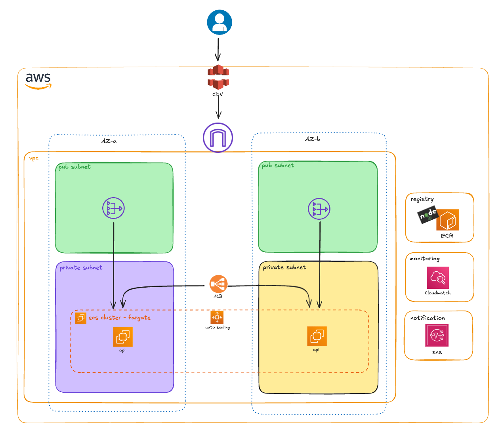

# AWS Automated API Deployment

A production-ready Node.js API deployed on AWS using ECS Fargate, with CloudFront CDN, auto-scaling, and comprehensive monitoring.

## Project Overview

This project demonstrates a highly available and scalable API architecture on AWS with:

- **ECS Fargate**: Serverless container orchestration
- **Application Load Balancer (ALB)**: Load balancing across availability zones
- **CloudFront**: Global CDN for low-latency access
- **ECR**: Private Docker container registry
- **Auto-scaling**: Dynamic capacity adjustment based on CPU/Memory
- **CloudWatch**: Metrics, logs, and alarms
- **VPC Endpoints**: Secure private AWS service access
- **Terraform**: Infrastructure as Code (IaC)

## Architecture



## Prerequisites

Before you begin, ensure you have the following installed and configured:

- [AWS CLI](https://aws.amazon.com/cli/) - `aws --version`
- [Docker](https://www.docker.com/) - `docker --version`
- [Terraform](https://www.terraform.io/) - `terraform --version`
- AWS Account with appropriate permissions
- AWS credentials configured (`aws configure`)

## API Endpoints

The API exposes the following endpoints:

- `GET /api` - Main API endpoint (returns hostname and message)
- `GET /health` - Health check endpoint

## Deployment Instructions

### Step 1: Create ECR Repository

Create a private Docker registry in AWS:

```bash
aws ecr create-repository --repository-name api-node
```

### Step 2: Authenticate Docker to ECR

Login to your ECR registry (replace account ID with your own):

```bash
aws ecr get-login-password | docker login --username AWS --password-stdin 443370700365.dkr.ecr.us-east-1.amazonaws.com
```

### Step 3: Build Docker Image

Build the Docker image for Linux AMD64 platform:

```bash
docker build -t api ./app --platform linux/amd64
```

### Step 4: Tag Docker Image

Tag the image with your ECR repository URL and version:

```bash
docker tag api:latest 443370700365.dkr.ecr.us-east-1.amazonaws.com/api-node:1.1
```

### Step 5: Push Image to ECR

Push the tagged image to ECR:

```bash
docker push 443370700365.dkr.ecr.us-east-1.amazonaws.com/api-node:1.1
```

### Step 6: Deploy Infrastructure with Terraform

Navigate to the infrastructure directory and apply Terraform:

```bash
cd infra

# Initialize Terraform
terraform init

# Review the execution plan
terraform plan

# Apply the infrastructure
terraform apply
```

Confirm by typing `yes` when prompted.

### Step 7: Verify Deployment

Wait for the infrastructure to be created. This may take 5-10 minutes.

## Testing the Deployment

### Test via Application Load Balancer

Test the API directly through the ALB:

```bash
curl http://$(terraform output -raw alb_dns)/api
```

### Test via CloudFront CDN

Get the CloudFront URL:

```bash
terraform output cloudfront_api_url
```

Test the API through CloudFront:

```bash
curl https://$(terraform output -raw cloudfront_api_url)/api
```

Example with hardcoded URL:
```bash
curl https://d24jq1gypac6i1.cloudfront.net/api
```

### Check CloudFront Distribution Status

Verify that CloudFront distribution is deployed:

```bash
aws cloudfront get-distribution \
  --id $(terraform output -raw cloudfront_distribution_id) \
  --query 'Distribution.Status'
```

Status should be `Deployed`.

## Monitoring and Performance Targets

### Key Performance Indicators (KPIs)

Monitor these metrics in CloudWatch:

| Metric | Target | Description |
|--------|--------|-------------|
| **Cache Hit Ratio** | >60% | Percentage of requests served from CloudFront cache |
| **Latency (P50)** | <50ms | Median response time |
| **5XX Error Rate** | <0.1% | Server error percentage |
| **Cost per Request** | <$0.0001 | Cost efficiency metric |

### View CloudWatch Metrics

Access CloudWatch metrics in the AWS Console:

1. Navigate to CloudWatch
2. Select **Metrics** → **All metrics**
3. Choose **ECS** or **ApplicationELB** namespace
4. Select your service metrics

### CloudWatch Alarms

The infrastructure automatically creates alarms for:
- High CPU utilization (>80%)
- High memory utilization (>80%)
- ELB 5XX errors
- Unhealthy target counts

Notifications are sent to the email configured in `variables.tf` (default: luisneu@gmail.com).

## Configuration

### Update Variables

Edit [infra/variables.tf](infra/variables.tf) to customize:

```hcl
variable "project_name" {
  default = "api-ha"
}

variable "vpc_cidr" {
  default = "10.0.0.0/16"
}

variable "alarm_email" {
  type    = string
  default = "your-email@example.com"  # Change this
}

variable "image_ecs" {
  type    = string
  default = "YOUR_ACCOUNT_ID.dkr.ecr.us-east-1.amazonaws.com/api-node:1.1"  # Change this
}
```

## Auto-Scaling

The ECS service automatically scales based on:

- **CPU utilization**: Scales up when CPU > 70%
- **Memory utilization**: Scales up when Memory > 70%
- **Min tasks**: 2 (high availability)
- **Max tasks**: 10 (cost control)

## Clean Up

To destroy all resources and avoid ongoing charges:

```bash
cd infra
terraform destroy
```

Also delete the ECR repository:

```bash
aws ecr delete-repository --repository-name api-node --force
```

## Troubleshooting

### ECS Tasks Not Starting

Check ECS service logs:

```bash
aws logs tail /ecs/api-ha --follow
```

### ALB Health Checks Failing

Verify the `/health` endpoint is responding:

```bash
curl http://$(terraform output -raw alb_dns)/health
```

### CloudFront Not Serving Requests

Ensure the distribution status is `Deployed`:

```bash
aws cloudfront get-distribution \
  --id $(terraform output -raw cloudfront_distribution_id) \
  --query 'Distribution.Status'
```

## Cost Optimization Tips

1. **Right-size ECS tasks**: Adjust CPU/memory in [infra/task-definition.tf](infra/task-definition.tf)
2. **Optimize CloudFront caching**: Increase TTL for static responses
3. **Use VPC endpoints**: Reduces NAT Gateway costs (already implemented)
4. **Monitor with AWS Cost Explorer**: Track spending by service

## Security Features

- Private subnets for ECS tasks
- Security groups with least privilege access
- VPC endpoints for AWS services (no internet gateway needed)
- IAM roles with minimal permissions
- CloudFront HTTPS enforcement
- Container image scanning in ECR

## License

This project is provided as-is for educational and reference purposes.

## Support

For issues or questions, please create an issue in the repository.
